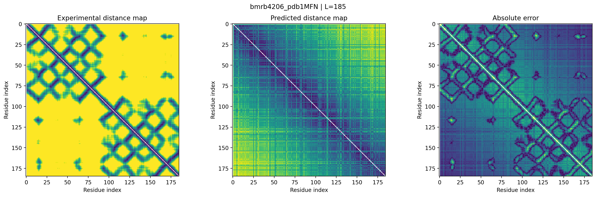

# ProteinStructureML

**Machine Learning for Protein Structure Prediction from Experimental NMR Data**

ProteinStructureML — исследовательский проект на стыке **Machine Learning, Bioinformatics и Computational Biology**, посвящённый предсказанию пространственной структуры белков по экспериментальным данным NMR.

Основная идея проекта — использовать не только аминокислотную последовательность, но и реальные **NMR chemical shifts**, чтобы предсказывать пространственные взаимосвязи между остатками белка.

---

## Research Pipeline

```text
BMRB
 │
 ├── Protein sequence
 └── NMR chemical shifts
          │
          ▼
   Feature preprocessing
          │
          ▼
      Neural Network
          │
          ├───────────────┐
          ▼               ▼
   Distance prediction   Contact prediction
          │               │
          └───────┬───────┘
                  ▼
          Predicted distance map
                  │
                  ▼
          3D structure reconstruction
```

### Используемые данные

Для формирования датасета используются связанные записи:

* **BMRB** — аминокислотные последовательности и NMR chemical shifts;
* **RCSB PDB** — экспериментально определённые 3D-структуры белков.

Для каждого sample формируется пара:

```text
INPUT
sequence
+
chemical shifts
+
chemical-shift mask

TARGET
Cα-Cα distance matrix
+
contact map
```

---

## Model

Первая рабочая модель ProteinStructureML использует **multi-task learning**.

### Residue Encoder

Для каждого остатка объединяются:

```text
Amino-acid embedding
+
NMR chemical shifts
+
availability mask
```

После этого формируется векторное представление каждого residue.

### Pairwise Representation

Для каждой пары остатков `(i, j)` строится pair representation:

```text
residue_i
residue_j
|residue_i - residue_j|
residue_i × residue_j
sequence separation
```

### Multi-task Heads

Одна pairwise representation используется двумя головами:

```text
                    Pair representation
                           │
                  ┌────────┴────────┐
                  ▼                 ▼
          Distance Head       Contact Head
                  │                 │
                  ▼                 ▼
           Distance (Å)       P(Contact)
```

Таким образом модель одновременно обучается:

1. предсказывать межостаточные расстояния;
2. определять контактируют ли два остатка.

Для contact prediction используется class-weighted binary cross entropy, поскольку реальные контакты занимают лишь небольшую часть всех residue pairs.

---

## Dataset

После первичной сборки и quality filtering получен обучающий набор из сотен protein samples.

Основные проверки:

* корректность BMRB ↔ PDB соответствия;
* наличие chemical shifts;
* покрытие экспериментальной структуры;
* ограничения по длине последовательности;
* отсутствие одинаковых последовательностей между train/validation/test.

Chemical shifts стандартизируются **только по training set**, чтобы избежать data leakage.

---

## Current Results

### Distance prediction

Текущая модель показывает:

```text
MAE  ≈ 3.05 Å
RMSE ≈ 4.16 Å
```

Для contact prediction:

```text
Precision ≈ 0.254
Recall    ≈ 0.531
F1        ≈ 0.311
```

Long-range benchmark:

```text
Average Precision ≈ 0.108
Top-L/5           ≈ 0.191
Top-L/10          ≈ 0.232
Top-L/20          ≈ 0.251
```

Это **промежуточные исследовательские результаты**, а не финальный benchmark проекта.

---

## Distance Map

Экспериментальная и предсказанная distance maps позволяют визуально сравнивать пространственную структуру белка.

### Experimental vs Predicted



---

## 3D Reconstruction

Предсказанная distance matrix используется для восстановления Cα-координат методом **Classical Multidimensional Scaling (MDS)**.

```text
Predicted distance matrix
          ↓
      Classical MDS
          ↓
      3D coordinates
          ↓
      Kabsch alignment
          ↓
       RMSD evaluation
```

При использовании полной экспериментальной distance matrix контрольная MDS-реконструкция восстанавливает структуру с практически нулевой ошибкой после учёта возможной зеркальной симметрии.

Текущая модель пока значительно хуже восстанавливает глобальную геометрию белка, что связано прежде всего с тем, что первоначальная версия модели была ограничена расстояниями до 20 Å.

---

## Current Architecture

```text
Protein Sequence
        +
NMR Chemical Shifts
        ↓
   Residue Encoder
        ↓
 Pairwise Representation
        ↓
 ┌──────────────────────┐
 │                      │
 ▼                      ▼
Distance Head       Contact Head
 │                      │
 ▼                      ▼
Distance Matrix    Contact Map
        │
        ▼
3D Reconstruction
```

---

## Tech Stack

```text
Python
PyTorch
NumPy
Pandas
SciPy
scikit-learn
Biopython
pynmrstar
Matplotlib
```

---

## Project Structure

```text
ProteinStructureML/
│
├── configs/
├── data/
├── notebooks/
│
├── src/
│   ├── data/
│   ├── features/
│   ├── models/
│   ├── evaluation/
│   ├── structure/
│   └── training/
│
├── scripts/
├── models/
├── results/
└── tests/
```

---

## Roadmap

```text
[x] BMRB / PDB dataset pipeline
[x] Experimental data preprocessing
[x] Quality filtering
[x] Sequence-aware train/test split
[x] Baseline distance model
[x] Multi-task distance + contact model
[x] Distance map evaluation
[x] Contact evaluation
[x] 3D reconstruction pipeline

[ ] Distance-bin prediction
[ ] Improved long-range prediction
[ ] GNN / attention architecture
[ ] Large-scale dataset
[ ] Improved 3D reconstruction
[ ] Structural benchmark
```

## Goal

The long-term goal of ProteinStructureML is to develop a machine-learning pipeline capable of transforming **experimental molecular measurements into useful structural constraints and ultimately a 3D protein structure**.

The project is being developed as an experimental computational-biology research system, with emphasis on reproducible data processing, model comparison and structural evaluation.
